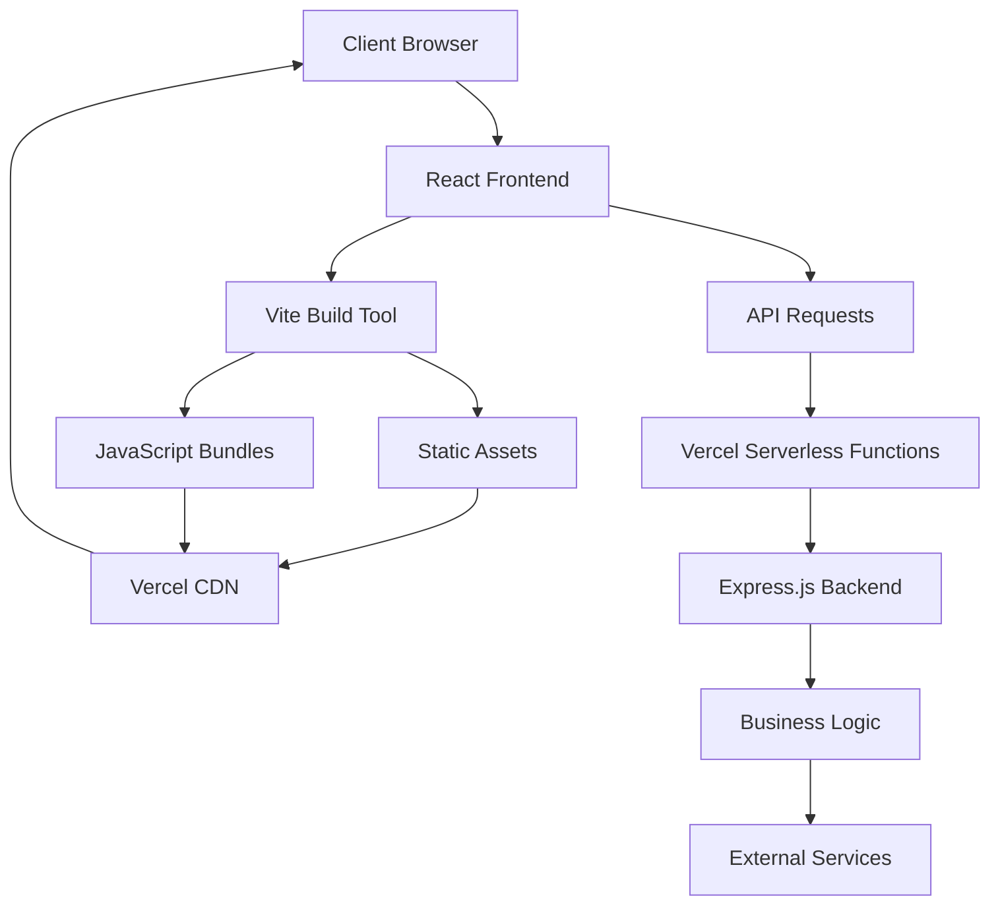
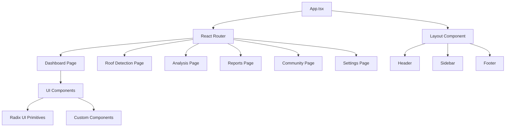
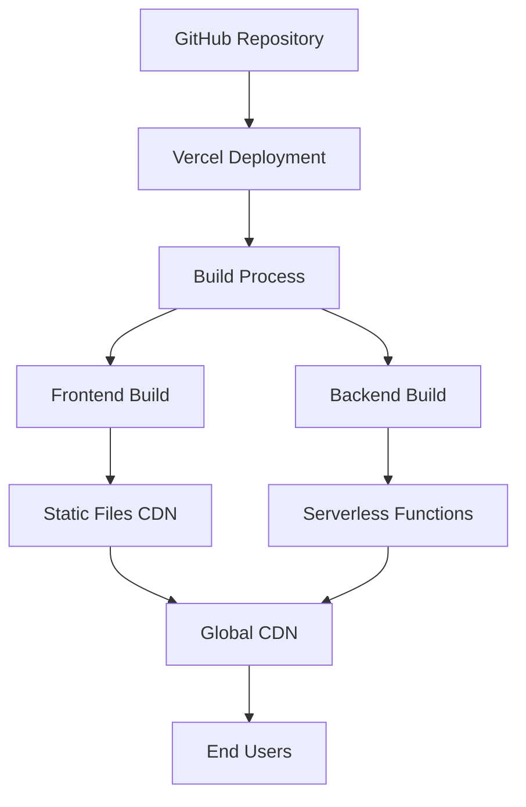
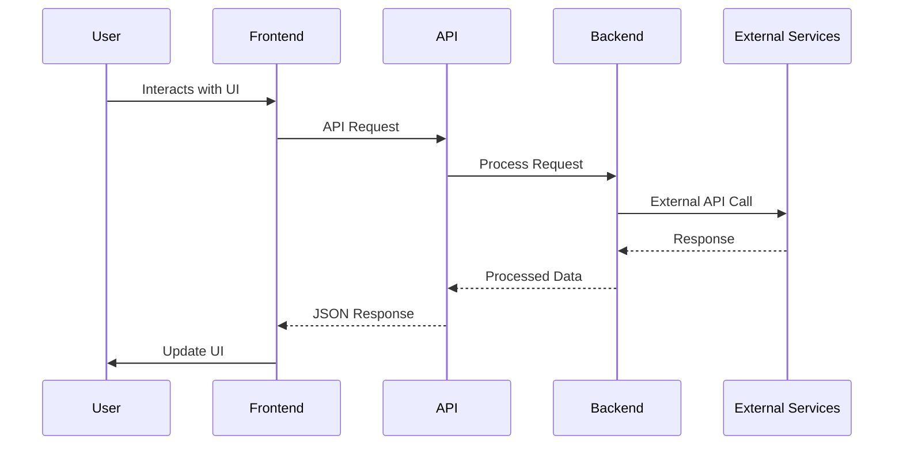
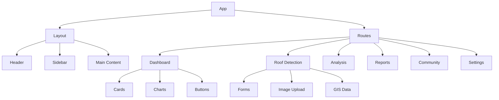
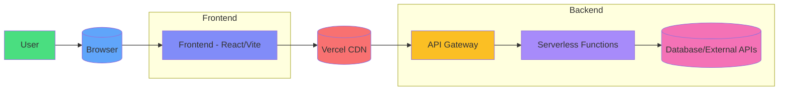
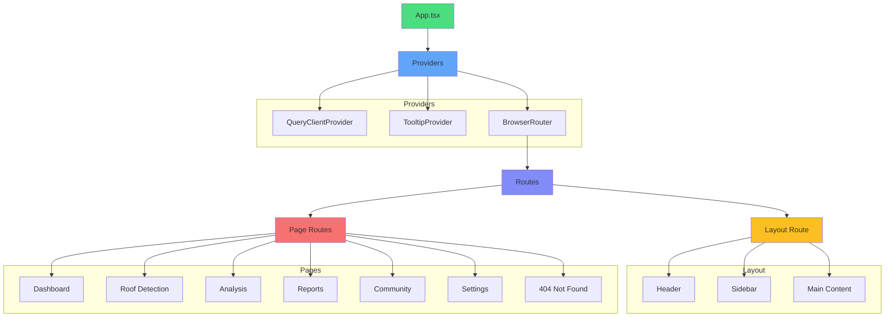
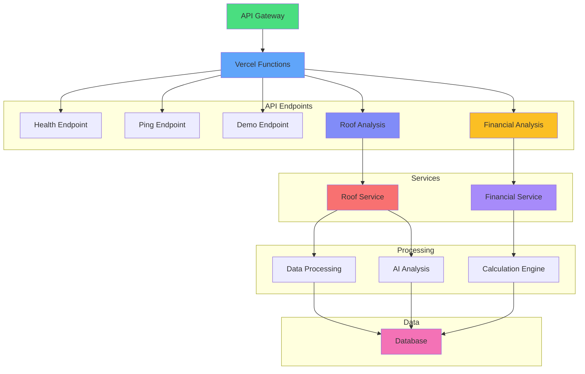
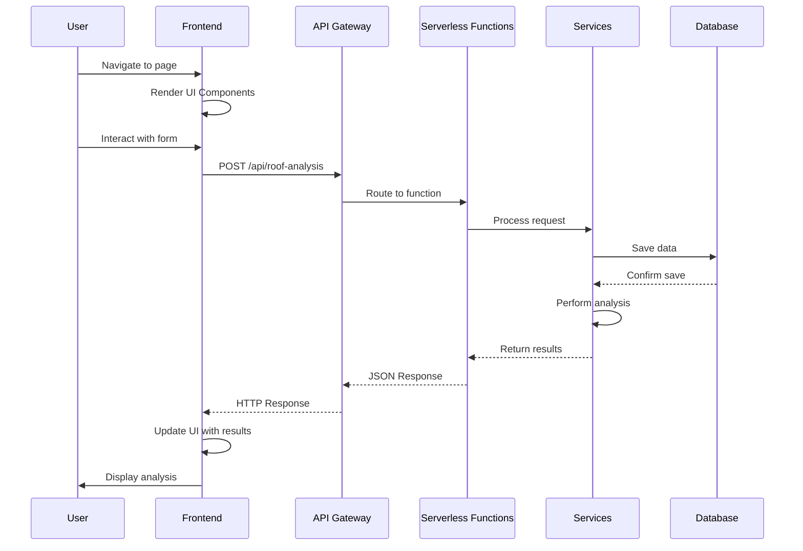
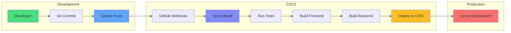

# SIH-2025 Architecture Overview

## System Architecture Diagram



## Frontend Architecture



## Backend Architecture

```mermaid
graph TD
    A[Vercel Serverless Functions] --> B[Express.js Server]
    B --> C[Middleware]
    C --> D[Route Handlers]
    D --> E[Business Logic]
    E --> F[Data Processing]
    F --> G[Response]
    B --> H[API Routes]
    H --> I[/api/ping]
    H --> J[/api/demo]
    H --> K[/health]
```

## Deployment Architecture



## Data Flow



## Component Hierarchy



## Technology Stack Overview

### Frontend Stack
- **Framework**: React 18.3.1
- **Build Tool**: Vite 7.1.2
- **Language**: TypeScript 5.9.2
- **Styling**: Tailwind CSS 3.4.17
- **UI Components**: Radix UI
- **State Management**: React Query 5.84.2
- **Routing**: React Router DOM 6.30.1

### Backend Stack
- **Runtime**: Node.js
- **Framework**: Express 5.1.0
- **Deployment**: Vercel Serverless Functions
- **Validation**: Zod 3.25.76

### Development Tools
- **Package Manager**: pnpm 10.14.0
- **Testing**: Vitest 3.2.4
- **Formatting**: Prettier 3.6.2
- **Linting**: ESLint

### Infrastructure
- **Hosting**: Vercel
- **CDN**: Vercel Edge Network
- **CI/CD**: GitHub + Vercel Integration

## File Structure Overview

```
sih-2025/
├── api/                 # Serverless functions
├── client/              # Frontend application
│   ├── components/      # UI components
│   ├── hooks/           # React hooks
│   ├── lib/             # Utilities
│   ├── pages/           # Page components
│   └── App.tsx          # Main app
├── documentation/       # Project docs
├── public/              # Static assets
├── server/              # Server code
├── shared/              # Shared code
└── Configuration files  # Build and deploy configs
```

## SEO and Performance

### SEO Implementation
- Meta tags for search engines
- Open Graph tags for social media
- Twitter Cards for Twitter sharing
- Canonical URLs
- Robots.txt configuration

### Performance Optimizations
- Code splitting with Vite
- Asset compression
- Image optimization
- Caching strategies
- Lazy loading components
- Bundle size optimization

## Security Measures

- CORS configuration
- Input validation with Zod
- Secure headers
- Environment variable management
- Rate limiting
- XSS prevention

## Monitoring and Analytics

- Vercel Analytics
- Performance monitoring
- Error tracking
- User behavior analysis
- Uptime monitoring

## Detailed Architecture Diagrams

### 1. High-Level System Architecture



### 2. Frontend Component Architecture



### 3. Backend API Architecture



### 4. Data Flow Architecture



### 5. Deployment Pipeline



This architecture provides a scalable, maintainable, and performant web application that can be easily deployed and monitored.