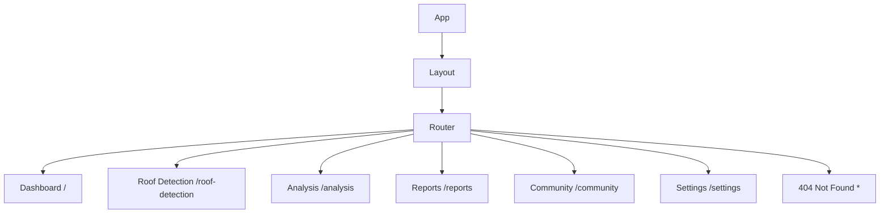

# SIH-2025 Frontend Documentation

## Table of Contents
1. [Overview](#overview)
2. [Architecture](#architecture)
3. [Project Structure](#project-structure)
4. [Technology Stack](#technology-stack)
5. [Component Structure](#component-structure)
6. [Routing](#routing)
7. [State Management](#state-management)
8. [Styling](#styling)
9. [Build Process](#build-process)
10. [Deployment](#deployment)

## Overview

The SIH-2025 frontend is a modern React application built with Vite, TypeScript, and Tailwind CSS. It provides a responsive dashboard interface for AI roof detection and water harvesting analysis. The application follows a component-based architecture with a clear separation of concerns.

## Architecture

The frontend architecture follows a modular pattern with the following key principles:

```
┌─────────────────────────────────────────────────────────────┐
│                         Browser                             │
├─────────────────────────────────────────────────────────────┤
│                    React Application                        │
├─────────────────────────────────────────────────────────────┤
│  Pages  │  Components  │  Hooks  │  Utilities  │  Styles   │
├─────────────────────────────────────────────────────────────┤
│                    React Router DOM                         │
├─────────────────────────────────────────────────────────────┤
│                    API Integration                          │
├─────────────────────────────────────────────────────────────┤
│                      Backend API                            │
└─────────────────────────────────────────────────────────────┘
```

### Key Architectural Components:

1. **Component Layer**: Reusable UI components built with Radix UI primitives
2. **Page Layer**: Page-specific components that compose UI components
3. **State Management**: React Query for server state, React Context for client state
4. **Routing**: React Router DOM for client-side navigation
5. **Styling**: Tailwind CSS with custom theme configuration
6. **API Layer**: Shared API utilities for backend communication

## Project Structure

```
client/
├── components/           # Reusable UI components
│   ├── layout/           # Layout components
│   └── ui/               # Radix UI based components
├── hooks/                # Custom React hooks
├── lib/                  # Utility functions
├── pages/                # Page components
├── App.tsx              # Main application component
├── global.css           # Global styles
└── vite-env.d.ts        # TypeScript declarations

public/
├── preview.jpg          # Social media preview image
└── robots.txt           # Search engine robots file

src/
├── index.css            # Entry point styles
└── main.tsx             # React DOM entry point
```

## Technology Stack

- **Framework**: React 18.3.1
- **Build Tool**: Vite 7.1.2
- **Language**: TypeScript 5.9.2
- **Styling**: Tailwind CSS 3.4.17
- **UI Components**: Radix UI
- **State Management**: React Query (TanStack Query 5.84.2)
- **Forms**: React Hook Form
- **Charts**: Recharts 2.12.7
- **Routing**: React Router DOM 6.30.1
- **Testing**: Vitest 3.2.4
- **Icons**: Lucide React

## Component Structure

The component structure follows a hierarchical pattern:

```
App.tsx
├── Layout.tsx
│   ├── Header
│   ├── Sidebar
│   └── Footer
├── Routes
│   ├── Index.tsx (Dashboard)
│   ├── RoofDetection.tsx
│   ├── Analysis.tsx
│   ├── Reports.tsx
│   ├── Community.tsx
│   └── Settings.tsx
└── UI Components
    ├── Accordion
    ├── Alert
    ├── Button
    ├── Card
    ├── Chart
    ├── Dialog
    ├── Form
    ├── Input
    ├── Table
    └── Toast
```

### Component Design Principles

1. **Reusability**: Components are designed to be reusable across different pages
2. **Composition**: Complex UIs are built by composing simpler components
3. **Consistency**: All components follow the same design language
4. **Accessibility**: Components are built with accessibility in mind using Radix UI

## Routing

The application uses React Router DOM for client-side routing:



### Route Configuration

Routes are defined in [App.tsx](../client/App.tsx):

```tsx
<Routes>
  <Route element={<Layout />}>
    <Route path="/" element={<Index />} />
    <Route path="/roof-detection" element={<RoofDetection />} />
    <Route path="/analysis" element={<Analysis />} />
    <Route path="/reports" element={<Reports />} />
    <Route path="/community" element={<Community />} />
    <Route path="/settings" element={<Settings />} />
  </Route>
  <Route path="*" element={<NotFound />} />
</Routes>
```

## State Management

The application uses a combination of state management solutions:

### Server State
Managed with React Query (TanStack Query):

- Data fetching and caching
- Background updates
- Request deduplication
- Pagination and infinite scrolling

### Client State
Managed with React Context and local component state:

- UI state (loading, errors, etc.)
- Form state
- User preferences

## Styling

The application uses Tailwind CSS for styling with a custom theme configuration.

### Theme Configuration

Defined in [tailwind.config.ts](../tailwind.config.ts):

- Custom color palette
- Spacing scale
- Typography settings
- Component variants

### CSS Architecture

```
global.css
├── Base styles
├── Component styles
├── Utility classes
└── Custom CSS
```

### Responsive Design

The application follows a mobile-first approach with responsive breakpoints:

- `sm`: 640px
- `md`: 768px
- `lg`: 1024px
- `xl`: 1280px
- `2xl`: 1536px

## Build Process

The build process is handled by Vite with the following configuration:

### Development Build
```bash
npm run dev
```

### Production Build
```bash
npm run build
```

### Build Configuration

Defined in [vite.config.ts](../vite.config.ts):

- TypeScript compilation
- Asset optimization
- Code splitting
- Environment variables
- Path aliases

### Output Structure

```
dist/spa/
├── assets/              # Compiled CSS and JS
├── index.html           # Main HTML file
└── ...                  # Other static assets
```

## Deployment

The application is deployed on Vercel with the following configuration:

### Vercel Configuration

Defined in [vercel.json](../vercel.json):

- Build settings
- Routing rules
- Header configuration
- Environment variables

### Deployment Process

1. Code is pushed to the repository
2. Vercel automatically detects the build configuration
3. Dependencies are installed
4. Application is built
5. Static files are deployed to CDN
6. Serverless functions are deployed

### Performance Optimizations

- Asset compression
- Image optimization
- Code splitting
- Caching strategies
- Lazy loading

## SEO and Social Media

The application includes comprehensive SEO optimizations:

### Meta Tags
- Title tags
- Description tags
- Keyword tags
- Author tags

### Open Graph Tags
- Title
- Description
- Image
- URL
- Site name

### Twitter Cards
- Card type
- Title
- Description
- Image
- URL

### Social Media Preview
The application uses [preview.jpg](../public/preview.jpg) for social media sharing with dimensions of 1200x630px.

## Testing

The application includes unit tests using Vitest:

### Test Structure
```
client/
└── lib/
    ├── utils.spec.ts    # Utility function tests
    └── ...              # Other test files
```

### Running Tests
```bash
npm run test
```

## Accessibility

The application follows WCAG guidelines for accessibility:

- Semantic HTML
- ARIA attributes
- Keyboard navigation
- Screen reader support
- Color contrast ratios

## Performance

Performance optimizations include:

- Code splitting
- Lazy loading
- Image optimization
- Bundle analysis
- Performance monitoring

## Security

Security measures include:

- Content Security Policy
- XSS prevention
- CSRF protection
- Input validation
- Secure headers

## Maintenance

### Code Quality
- TypeScript for type safety
- ESLint for code linting
- Prettier for code formatting
- Husky for git hooks

### Documentation
- Component documentation
- API documentation
- Architecture documentation
- Deployment guides

### Updates
- Dependency updates
- Security patches
- Browser compatibility
- Feature enhancements